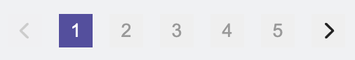

# Elice frontend programming assignment

엘리스 프론트엔드 프로그래밍 과제를 구현한 레포지토리입니다.

## 프로젝트 실행

패키지 매니저는 yarn을 사용하였습니다.  
프로젝트 실행을 위해 다음 명령어를 입력합니다.

```sh
yarn
yarn start
```

```sh
npm i
npm run start
```

명령어 입력 후 브라우저에서 `http://localhost:3000` 에 접속하면 프로젝트가 실행됩니다.

## 사용 모듈

프로젝트를 구현하기 위해 다음의 모듈을 사용하였습니다.

- react
- react-router-dom
- typescript
- axios
- react-query
- lodash-es
- styled-components
- sanitize.css
- fontawesome
- eslint
- prettier
- stylelint

## 폴더 구조

프로젝트에서 사용하는 폴더 구조는 다음과 같습니다.

- `api`: api endpoint 및 관련 로직 정의
- `components`: 프로젝트 전역에서 공통으로 사용하는 공용 컴포넌트 폴더 (e.g. Chip, SearchInput 등)
- `hooks`: 사용자 커스텀 훅 폴더 (e.g. 과목 검색 시, 검색 필터 관리를 위한 `useCourseFilter`)
- `layouts`: 레이아웃 컴포넌트 관리
- `pages`: 페이지에서 사용하는 컴포넌트 관리
- `queries`: 서버에 있는 데이터 fetch를 위한 react query 정의
- `routes`: 라우터 주소 관리
- `styles`: 전역 스타일 관리

## 주요 구현 내용

### 공용 컴포넌트 구현

프로젝트에 필요한 공용 컴포넌트를 직접 구현하였습니다.  
요구사항에 맞는 스타일을 적용하였으며 요구사항에 없는 내용은 엘리스 페이지와 비슷하게 적용하였습니다.  
구현한 컴포넌트는 다음과 같습니다.

- Chip
- Filter
- Pagination
- SearchInput
  
  

### 검색 필터 구현


- 검색 필터를 위한 `useCourseFilter` 커스텀 훅을 구현하였습니다. 과목 목록을 불러오기 위해 검색 필터를 사용하므로, 재사용성을 위해 커스텀 훅을 구현하였습니다.
- 브라우저를 새로고침 해도 필터 정보를 유지하기 위해 react-router-dom의 `useSearchParams()`을 사용해서 params에 있는 `keyword`, `price`의 query string을 읽어와서 필터를 설정합니다. 또한 검색어 입력 또는 가격 필터 클릭시 해당하는 필터의 query string을 설정하게 구현하였습니다.
- 검색 인풋의 경우 이벤트 호출 최적화를 위해 decounce를 적용하였고, `lodash-es` 라이브러리를 사용하여 300ms의 debounce를 적용하였습니다.

### 과목 목록 구현


- react-query를 사용해서 과목 목록을 불러오게 구현하였습니다. 서버에서 데이터를 가져오거나, 캐싱, 에러 핸들링 등의 비동기 처리를 쉽게 구현하기 위해 react-query를 사용하였습니다.
- 서버에서 응답하는 과목 목록 데이터의 `enroll_type`, `is_free`는 사용자가 이해할 수 없는 내용이므로, react-query에서 제공하는 select를 사용하여 사용자가 이해할 수 있는 데이터(무료, 유료, 구독)로 변환하였습니다. 또한 클라이언트에서 원하는 이름으로 속성을 변경하였습니다.
- 과목 검색 시, 검색 결과가 없거나, 에러가 발생한 경우 해당 내용이 사용자에게 보여지도록 구현하였습니다.

## 전체 동작 화면


